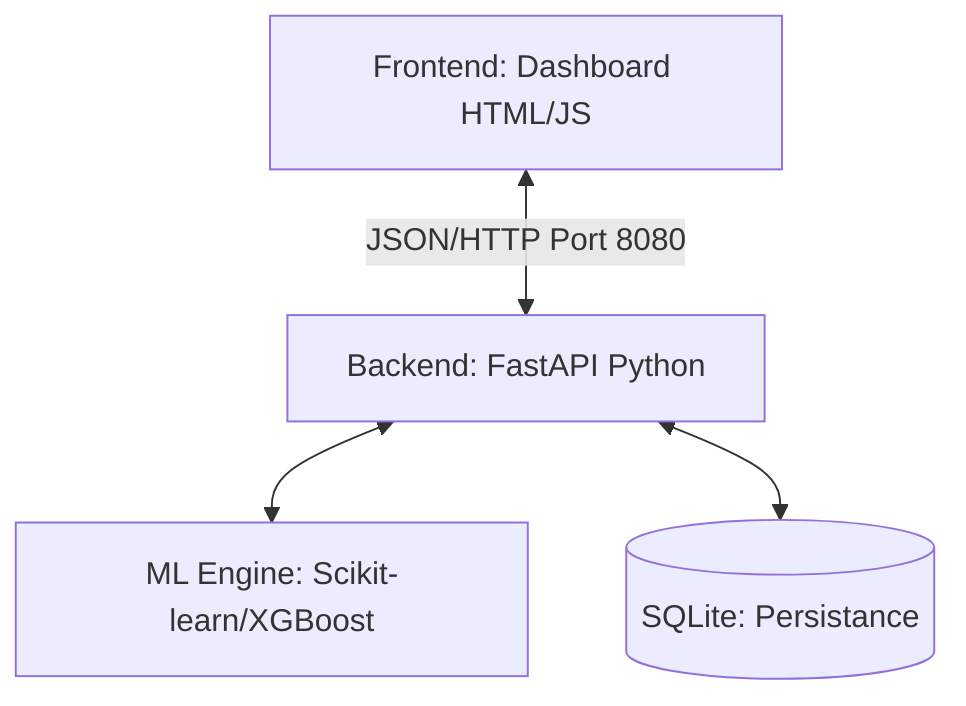

# AI4CKD - Intelligence Artificielle au Service de la Santé Rénale

 

**AI4CKD** est un système expert conçu pour la détection précoce, la classification et la priorisation des patients atteints de **Maladie Rénale Chronique (CKD)** au Bénin.

---

## 🚀 Vue d'Ensemble

Le projet combine une API de prédiction robuste (Backend) et une interface de pilotage intuitive (Frontend) pour offrir aux cliniciens :
- **Prédiction de Stade** : Identification du stade DFG (G1 à G5) via un algorithme de Gradient Boosting (XGBoost).
- **Score Clinique SR-IRC** : Un barème de 0 à 40+ évaluant instantanément l'urgence médicale.
- **Visualisation Géo-sanitaire** : Cartographie dynamique de la sévérité par département pour l'aide à la décision publique.

---

## 🏗️ Architecture Technique



### Stack Technologique
- **Backend** : FastAPI, Pydantic, SQLAlchemy.
- **IA** : XGBoost, CatBoost (Stacking Pipeline), Joblib.
- **Frontend** : Vanilla JS, CSS3, Leaflet.js (Cartographie), Chart.js (Visualisation).

---

## 📊 Score Clinique SR-IRC

Le système implémente un score de risque de progression (SR-IRC) calculé selon les paramètres cliniques :

| Score | Niveau de Risque | Recommandation Clinique |
| :--- | :--- | :--- |
| **> 40** | 🔴 **Imminent** | Hospitalisation / Urgence Néphrologique |
| **31 - 40** | 🔴 **Très élevé** | Préparation dialyse / Suivi mensuel |
| **21 - 30** | 🟠 **Élevé** | Suivi trimestriel spécialisé |
| **11 - 20** | 🟡 **Modéré** | Surveillance biologique semestrielle |
| **0 - 10** | 🟢 **Faible** | Mesures de néphroprotection standard |

---

## 🛠️ Installation et Lancement Local

Suivez ces étapes pour exécuter le projet sur votre machine.

### 1. Installation des dépendances
```powershell
python -m venv venv
.\venv\Scripts\activate
pip install -r requirements.txt
```

### 2. Lancement des services
Le projet utilise une configuration à deux ports pour séparer les services.

**Fenêtre 1 : Backend (API)**
```powershell
.\venv\Scripts\python -m uvicorn src.main:app --port 8000 --reload
```
*Doc Swagger accessible sur : http://localhost:8000/docs*

**Fenêtre 2 : Frontend (Interface)**
```powershell
cd dashboard/ui_mockup
python -m http.server 8080
```
*Interface accessible sur : [http://localhost:8080](http://localhost:8080)*

---

## 📁 Structure du Projet

```text
ai4cdk/
├── src/                    # Code source de l'API
│   ├── routes/             # Endpoints (Health, Predictions)
│   ├── services/           # Logique métier et Scoring
│   └── assets/             # Modèles ML et encodeurs
├── dashboard/              # Interface utilisateur
│   └── ui_mockup/          # HTML/CSS/JS statique
├── ai4ckd.db               # Base de données locale (SQLite)
└── requirements.txt        # Dépendances Python
```

---

## 👨‍💻 Développé pour le Hackathon IA Bénin 2025
*Ce projet est un prototype fonctionnel destiné à illustrer le potentiel de l'IA dans la gestion de la santé rénale.*
